# Part1
## Broswer.png
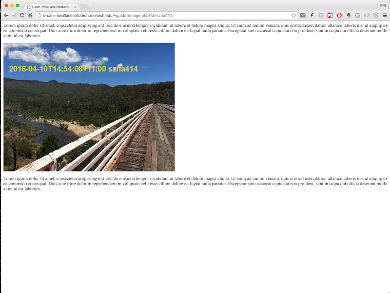

## question a

- packet numbr: 47
- request line: "GET /~guidot/image.php?id=szha414 HTTP/1.1\r\n"

## question b

- source device: Apple_8e:2f:f4 (98:5a:eb:8e:2f:f4)
- destination device: CiscoInc_9f:f0:04 (00:00:0c:9f:f0:04)

## question c
### method1
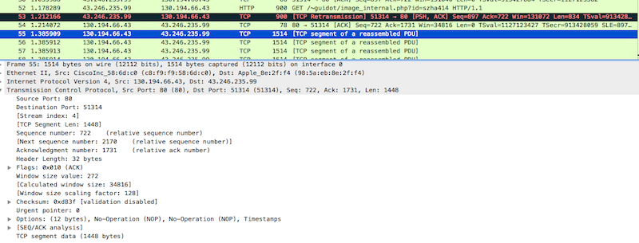

Packet 55 is the first image data packet, and there are handreds of similar packet, so we can estimate the efficiency by computing the efficiency of this packet.

According to the picture, the packet length is 1514 bytes, and the length of this segment is 1448 bytes, so the answer is 0.956 (1448/1514)

### method2
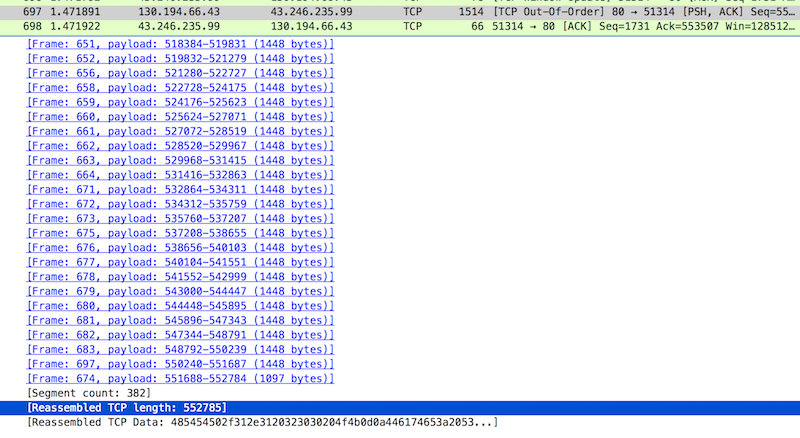
There are 382 packets, each has 1514 bytes length, and the total length of the data is 552784 bytes, so the efficiency is 552784 / (1514 * 382) = 0.955.

## question d
- keep-alive: the connection can be reused in a time range.
- close: close the connection once the client has received all data.
- advantage:

	Take request a web page as an example. The client request for not only the web page itself, but also other dependent documents. By Using keep-alive, only one TCP connection need to be seted up, otherwise it will set up a TCP connection for every dependent documents, which  is unefficient.
	
	What's more, by using keep-alive, it is possible that let server push some information to client forwardly, so the web page can display real time information without refresh frequently.

	
## question e
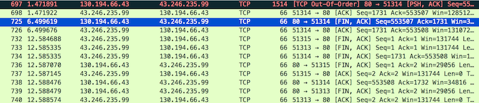

Packet 725: the server is going to close, so it sends a `FIN` to client(port:51314) and change it's status to `FIN wait 1`. (The `ACK` is for the previous packet 698)

Packet 734: the client received the `FIN`. It replies the `ACK` to this `FIN`, and sends a `FIN` to server to indicates that it's going to close as well. Now the client's status is `FIN wait 1`.

Packet 738: the server received the `ACK` for the previous `FIN`, it can be closed now, and it replies a `ACK` for client's `FIN`.
The client receives the `ACK` from server, and it can be closed now.

## question f
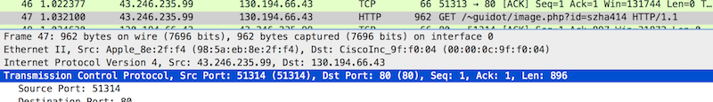

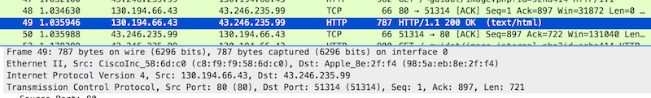

Packet 47 client -> server (seq=1, ack=1, len=896):

	Client sends a http request to sever. seq=1 means this is thnn sequence number for the 1st byte in the segment, ack=1 means the client expect the server send the byte start from the sequence number = 1.

Packet 48 server -> client (seq=1, ack=897):

	Server send a ACK for previous request. seq=1 because this is the sequence number for the 1st byte in the segment as well, ack=897, because the server has received 896 bytes data from client, and it expects the byte start from the sequence number = 897.

Packet 49 server -> client (seq=1, ack=897, len=721)

	After replies ACK, server begin to send data.
	
Packet 50 client -> server (seq=897, ack=722)

	The client has received the data from server and replies a ack. seq=897 because this message start from sequence number 897, ack=722 because it has received 721 bytes, and it expect the byte start from the sequence number = 722.

# Part2

## Modulation A

- type of coding: (AM, PM)

- size of symbol: 2 bits

- constellation diagram

	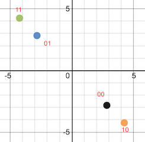

	- link: [https://www.desmos.com/calculator/nb25yhooet](https://www.desmos.com/calculator/nb25yhooet)

- wave form
	
	- **00**
		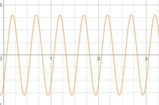
		
	- **01**
		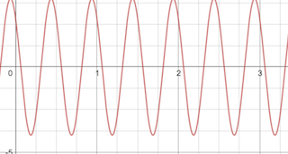
		
	- **10**
		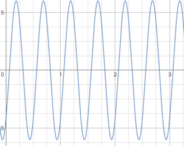
		
	- **11**
		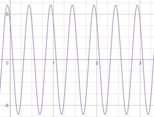
	
	- **link**: [https://www.desmos.com/calculator/avf1jtlkix](https://www.desmos.com/calculator/avf1jtlkix)

- demodulate: 0010110011010010

## Modulation B

- type of coding: (AM, PM)
- size of symbol: 4 bits
- constellation diagram

	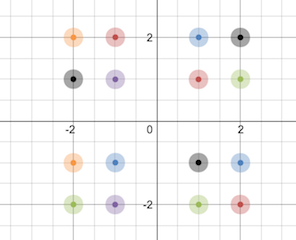
- wave form

	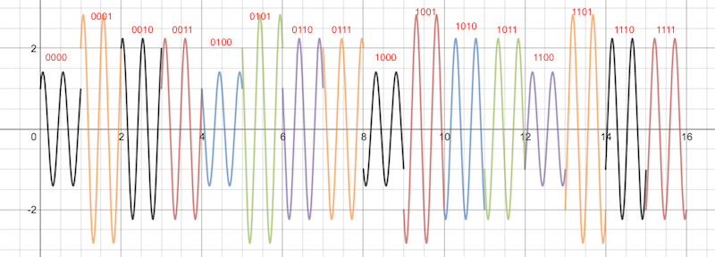

- link: [https://www.desmos.com/calculator/6hz2qzxfn6](https://www.desmos.com/calculator/6hz2qzxfn6)

## Digital encoding

### Bipolar Non Return to Zero Inverted
- 0: signal does not have transmitted.
- 1: signal has transmitted at clock boundary.
- wave form
	
	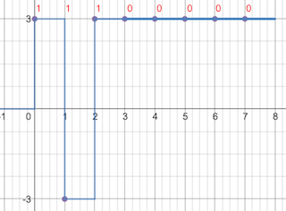
- link: [https://www.desmos.com/calculator/tidpahuyxc](https://www.desmos.com/calculator/tidpahuyxc)

### Manchester Encoding
- 0: low to high in the middle
- 1: high to low in the middle
- wave form

    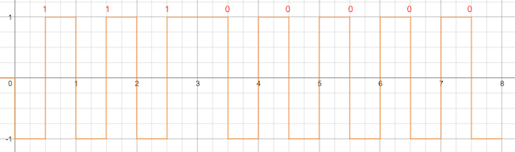
- link: [https://www.desmos.com/calculator/fonqchgy7s](https://www.desmos.com/calculator/fonqchgy7s)
