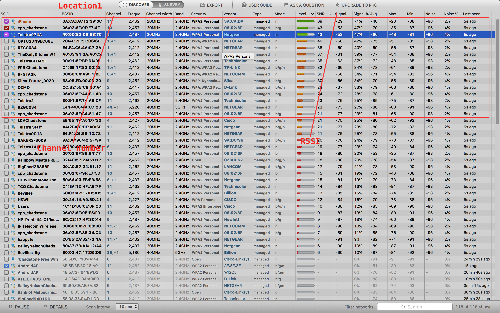
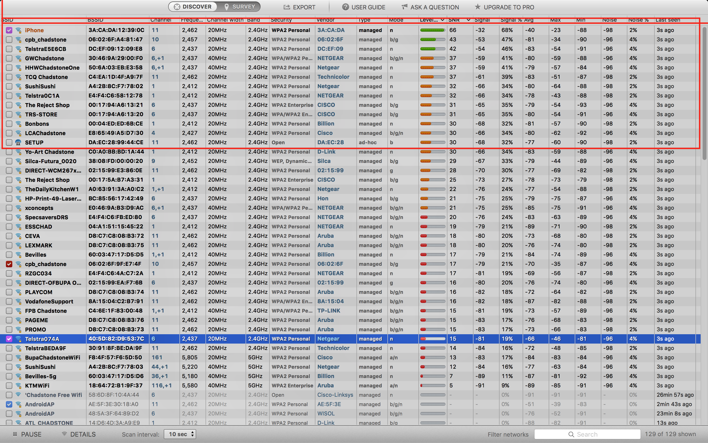
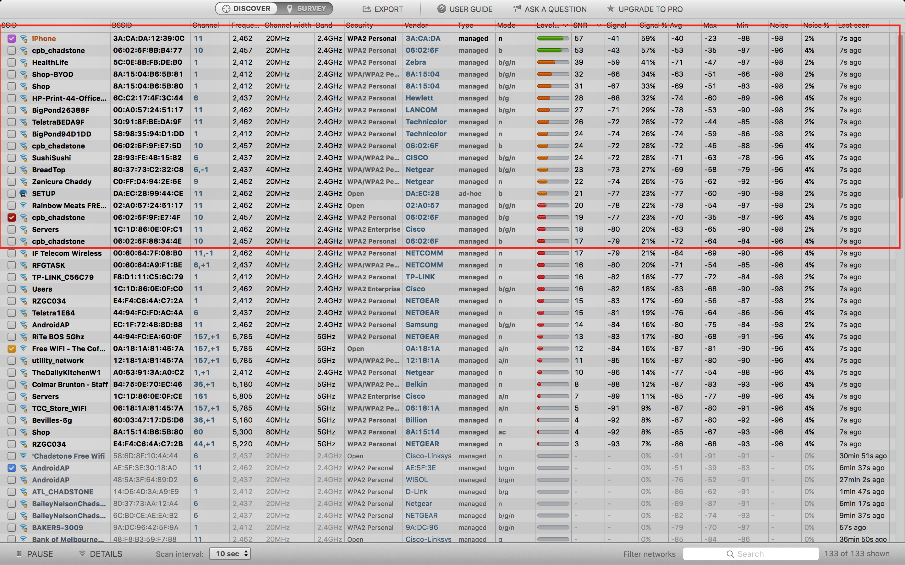

# Report

## Screen shot
Group member( Huajun Gao 27092348, Shizhe Zhao 27505928)

- location 1: 
- location 2: 
- location 3: 

## Channel occupancy

As we know, in Australia, 2.4 GHz has 11 channels, from 1 to 11, and 5 GHz has 8 channels, from 36 to 44. 

According to the channel frequency distributions, when the differ of channel numbers more than 5, two channels can not interference to each other. In this question, we roughly consider neighbour channels, and if the number of APs in those channels more than 5, they are crowed channels, otherwise, they are free channels.
Consider the top 10 strong endpoint in 1st screen shot, 

**crowed channels** are:
    
1. channel 9, 10, 11 (total 7)
    - iPhone `11`
    - TelstraBEDA9F `11`
    - Telstra2 `11`
    - cpb_chadstone(06:02:6F:9F:E7:4F) `10`
    - cpb_chadstone(06:02:6F:A4:81:4B) `10`
    - cpb_chadstone(06:02:6F:A4:81:47) `10`
    - Silca-Future_0020 `9`

3. channel 1, (1, +1), 2 (total 5)
    - OPTUSDN9EC66E (1, +1)
    - TheDailyKitchenW1 (1, +1)
    - FPB Chadstone (1, +1)
    - RZGC034 (1)
    - OZMO (2)

**free channels** are:

1. channel 5: Telstra074A
2. channel (6, +1): RFGTASK
3. channel (44, +1): RZGC034
4. and all other channels from 1 to 11, 36 to 44 not appear on the list.

## Interference and effects

### Interference
Wireless transmitter modulate signal by frequency and transmit signal by air. For some physics reason, when 2 signal modulated by similar frequency width encounter, inner information will broken.

### Effects
Since the interference, APs transmission must be well organized, and WI-FI protocal use CSMA-CA mechanism to avoid 2 APs transmit signal with similar frequency width at same time. Thus, in a crowed channel, each AP has to wait for a long time to be allowed transmit signal.

## Dual band advantages
1. Reduce interference.
Larger frequency band means less likely to be interfered by other device like Bluetooth devices, microwave ovens and mobile phone.

2. Reduce crowding.
Dual band can use more channel, so we are more likely to find a free channel instead of keep using crowd channel. Since crowding channel has lower transmission efficiency, dual band also means higher speed.

In the screen shot, **RGZCO34** has dual band(802.11n 5GHz)

## Security situation of the wireless network
Because radio waves can travel in all directions and goes out of the building,
wireless communication is very easy to eavesdrop. In a encrypted WLAN, even your messages are visible, others can not dig out the inner information, unless they crack the security protocal, which is very difficult. While in a open WLAN, your messages are unencrypted, and others can easily steal your private information. 

In the 3rd screen shot, **SETUP** and **Rainbow Meats FREE** are open WLAN.

## Roaming between access points
In order to let Wifi cover a large area like chadstone, we need set up ESS which is a set of BSSs. When client roaming in this covered area, it can switch from a AP to another. Notice that 802.11 doesn't support roaming, it is required a higher-level protocol(Mobile IP).
In both three screen shots, there is a SSID called **cpb_chadstone** with different BSSID, which indicate that we were roaming between those access points.

## Extra
From the both 3 screen shots, we can find that all **cpb_chadstone** APs were using channel 10. In the first location, the RSSI of two **cpb_chadstone** APs were very close, which means those two APs may interfere each other, and increasing the channel crowding. Obviously this is a bad design. A feasible solution is using dynamic channel, so that close APs can negotiate to each other and find a suitble channel configuration.

# Network	Design	and	bug fixing

## A

### Find & Fix

#### **error1**

R1's route table is like:

    default via 163.5.5.1 dev eth3
    55.135.72.0/24 via 220.129.51.1 dev eth0
    67.124.83.0/24 dev eth2  proto kernel  scope link  src 67.124.83.1
    163.5.5.0/24 dev eth3  proto kernel  scope link  src 163.5.5.2
    164.220.97.0/29 via 189.81.86.10 dev eth1
    189.81.86.0/24 dev eth1  proto kernel  scope link  src 189.81.86.4
    220.129.51.0/24 dev eth0  proto kernel  scope link  src 220.129.51.2

No rule for subnet `164.220.97.0/24`, and the 5th row is similar, so it might be a mistake.
We have 2 options to fix this:

1. add a new rule:

        ip route add 164.220.97.0/24 via 189.81.86.10

2. change the 5th row like this:

        164.220.97.0/24 via 189.81.86.10 dev eth1

 
Now the package can pass from 55.135.72.0/24 to 164.220.97.0, but `ping` still failed, so let's check R2.

#### **error2**

R2's route table says `55.135.72.0/24 via 67.124.83.1 dev eth2`, which means package will go to R4, however R4's route table is like:

    default via 163.5.5.1 dev eth3 
    67.124.83.0/24 dev eth2  proto kernel  scope link  src 67.124.83.1
    163.5.5.0/24 dev eth3  proto kernel  scope link  src 163.5.5.2
    164.220.97.0/24 via 189.81.86.10 dev eth1 
    189.81.86.0/24 dev eth1  proto kernel  scope link  src 189.81.86.4
    220.129.51.0/24 dev eth0  proto kernel  scope link  src 220.129.51.2

It doesn't know how to reach subnet 55.135.72.0/24.
So we have 2 options to fix this problem:

1. change R2's route table to :

        55.135.72.0/24 via 189.81.86.1

2. add a rule in R4:

        ip route add 55.135.72.0/24 via 220.129.51.1

Now `ping 189.81.86.10` at R1 can be successful.

#### error3
But ping webserver still fail, so let's check webservers' configure.
To webserver, it's subnet mask is wrong:

        164.220.97.12/30
        fix:
        164.220.97.12/24

#### error4
To webserver2, webserver3 and sshserver, their ip route like:

    default via 164.220.97.1 dev eth0

However, the ip address of interface of R2 is `164.220.97.4/24`, and there is no `164.220.97.1/24`, so we have 2 options to fix this problem:

1. change R2 eth1's ip address:

        164.220.97.1/24

2. change `default`:

        ip route delete default
        ip route add default via 164.220.97.4

#### error5

The last error is that dnsserver does not connect to R2, because they are in different subnet. We can fix this problem by giving dnsserver a new ip address in subnet 92.170.73.0/24, according to the `maradns` configuration, the new ip address should be:

        92.170.73.100/24
### Test

1. Ping webservers, sshservers, dnsserver at client, success;
2. Test webserver service by using `lynx 164.220.97.12`, success;

Since there are no http service running on webserver2 and webserver3, `lynx` to them will fail. But this is not a error.

## B

- Add route rule in **R1** and **R2**

        # R1
        ip route add default via 220.129.51.2
        
        # R2
        ip route add default via 67.124.83.1

- Add route rule in **R3**
        
        # to each subnet
        ip route add 55.135.72.0/24 via 163.5.5.2
        ip route add 164.220.97.0/24 via 163.5.5.2
        ip route add 92.170.73.0/24 via 163.5.5.2
        
- Add route rule in **R4**

        # let R4 know the subnet 92.170.73.0/24
        ip route add 92.170.73.0/24 via 67.124.83.2

- Test

    1. add new client **n3** in outer network;
    2. from **n3** ping every subnet;

## C

Edit firewall rules on **R4**

- Add default rule to drop all packages

        iptables -P FORWARD DROP

- Enable other interface except eth1 (subnet 164.220.97.0/24)

        iptables -A FORWARD ! -o eth1 ! -i eth1 -j ACCEPT

- Allow ssh (tcp port 22)

        iptables -A FORWARD -p tcp --sport 22 -j ACCEPT
        iptables -A FORWARD -p tcp --dport 22 -j ACCEPT

- Allow http (tcp port 80)

        iptables -A FORWARD -p tcp --sport 80 -j ACCEPT
        iptables -A FORWARD -p tcp --dport 80 -j ACCEPT

### Test
- Let client ping dnsserver, success.
- Let client ping webserver, faild. ()

## D

See in assignment2-error-x27505928.imn.